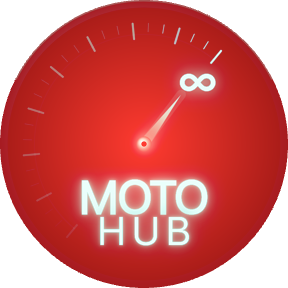
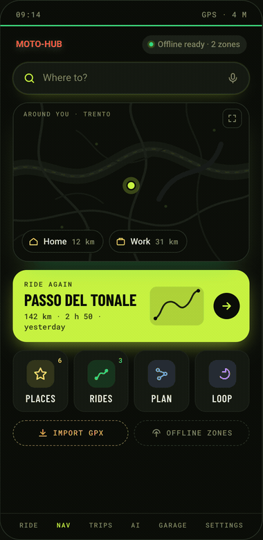
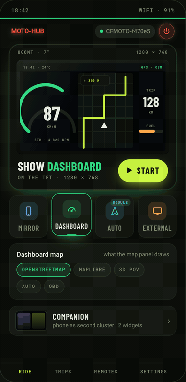
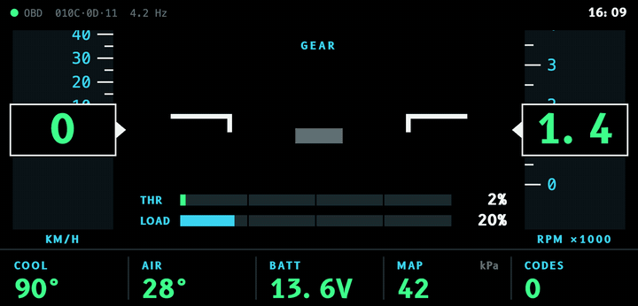
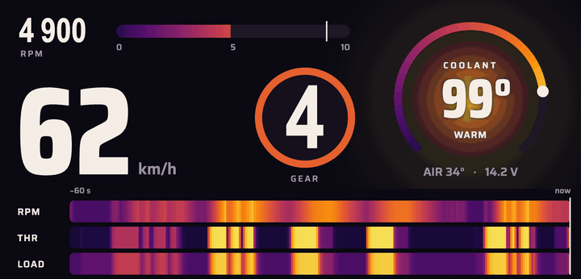
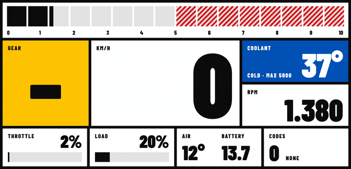
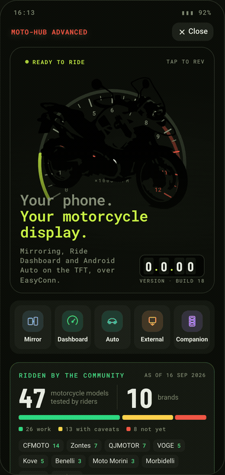

# MOTO-HUB ADV-SOLO

**The riding app for every motorcyclist, on any motorcycle. Free, forever.** 
**And if your bike has a compatible TFT, it takes that screen over too.**

&nbsp;

 
On the phone, on any motorcycle &middot; on the bike's TFT, when it has a compatible one.

Motorcycle **navigation** with curvy routes and loop rides, **trips** recorded with full telemetry and replayed in 3D, a **Riding Coach**, a full **engine analysis** from a cheap OBD adapter, **AI place discovery** and **group intercom**. **All from your phone, whatever you ride.**

### 🅰️ Android Auto &nbsp;·&nbsp; 🏍️ Ride Dashboard &nbsp;·&nbsp; 📱 Mirroring

**Got a dashboard with a pairing QR code? The same app puts them on your bike's TFT**, driven from the handlebar.

 

On the release page, expand <b>Assets</b> and download the file ending in <code>.apk</code>.

 

### 💬 Come and ride with us

**Every rider here is on Discord.** Get help when something misbehaves, try early builds, and help decide what gets built next.

**This repository contains no source code.** MOTO-HUB ADV-SOLO is closed source. Only signed release APKs are published here, under the [Releases](../../releases) tab. The app also checks this page for its own updates.

## Not just a TFT app

> [!IMPORTANT]
> **You don't need a compatible dashboard to use MOTO-HUB.** Mirroring your phone and Android Auto on the TFT are only one part of it. Most of what the app does runs on the phone and works on **any motorcycle, from any brand, of any age**: a naked with no screen at all, a classic, a scooter or a track bike.

| | 📱 Any motorcycle, just your phone | 🖥️ Plus a compatible TFT |
| --- | :---: | :---: |
| **Navigation**: turn-by-turn, curvy routes, loop rides, route comparison | ✅ | ✅ on the dash too |
| **Route intelligence**: weather along the route, fuel prices, speed cameras, street view | ✅ | ✅ |
| **Satellite imagery and 3D terrain** | ✅ | ✅ |
| **Trips**: full-telemetry recording, 3D replay, lean angle and G-forces, GPX, ride it again as a route | ✅ | ✅ |
| **Riding Coach**: a score, key moments and an AI review of every ride | ✅ | ✅ |
| **Engine analysis per ride** with an ELM327 OBD adapter: revs and gears, heat, charging, throttle, fault codes | ✅ | ✅ |
| **OBD on the phone**: live data, fuel & air, odometer & counters, stored codes, full scan | ✅ | ✅ |
| **AI place discovery** | ✅ | ✅ |
| **Group intercom**: voice, music and directions rider to rider | ✅ | ✅ |
| **Audio notes** pinned to your trips | ✅ | ✅ |
| **Bluetooth handlebar remotes** such as the LIVALL BR80 | ✅ | ✅ |
| **Companion display**: a phone on the bars as your dashboard | ✅ | ✅ |
| **Home Assistant**, **backup & restore**, **10 languages** | ✅ | ✅ |
| **Ride Dashboard and roadbook** drawn on the bike's TFT | — | ✅ |
| **OBD engine cluster** on the TFT in four styles | — | ✅ |
| **Screen mirroring** and **Android Auto** on the TFT | — | ✅ |
| The **bike's own handlebar buttons** driving the app | — | ✅ |

## Coming from MOTO-HUB CORE + ADVANCED?

**ADVANCED is retired, and ADV-SOLO replaces both apps.** Install ADV-SOLO: it brings over your motorcycles, rides, audio notes, places, keys and settings from ADVANCED, then asks you to remove ADVANCED and CORE. Android Auto is a module here, one tap away in **Settings ▸ Modules**.

## Free, forever

**MOTO-HUB ADV-SOLO is a free app, and it always will be.** Every feature on this page is in the download, for everyone, today:

- **No price, no subscription, no ads**, and no account to create.
- **Nothing locked.** Every feature described here is free, and **it will stay free forever**. Nothing that's free today will ever move behind a paywall.
- **Updates are free too**, and the app installs them for you.

A few optional extras talk to outside services with **your own key**, such as an AI provider for the Riding Coach review and place discovery, or satellite and street-level imagery. MOTO-HUB doesn't charge for them. If optional paid services are ever added in the future, they'll be new extras on top of the free app, never a toll on what you already have.

## For every rider, on any motorcycle

### 🧭 Navigation, built for motorcycles

Search a destination and get **motorcycle routing**, including *curvy roads* when the fastest line isn't the point.

- **Turn-by-turn on the phone:** a map that follows you, the next turn, your speed against the limit, speed-camera warnings and arrival time.
- **A dial for how you want to ride:** drag between *fast* and *curvy* and watch the route change, then **compare routes** by minutes, bends, climb, motorway, fuel and weather.
- **Loop rides:** say how long you want to be out and how much you want to lean, and get a ride that brings you home on real roads.
- **Waypoints by drag**, and **Stop off** for fuel, coffee or a break, priced in minutes added.
- **Places and Rides:** favourites and recents in one page; rides you can rename, reorder, merge and filter; **GPX files** opened straight from Komoot, Kurviger, Calimoto or a chat.
- **Satellite imagery and 3D terrain** on the map, plus offline map areas.

 

The route preview is a briefing, not just a line on a map:

- **Where the curves are:** which stretches actually bend, and what the twisty line costs you against the fast one.
- **The shape of the ride:** total ascent, number of turns, and an elevation profile.
- **Weather along the route:** rain cells with the time you'll meet them, crosswind and ice risk.
- **Fuel prices on the route:** live official price data in 🇮🇹 🇪🇸 🇫🇷 🇵🇹, merged with the stations on your path.
- **Speed cameras:** an approaching-camera alert on the phone, and on the TFT when you have one. It's off by default and automatically disabled in countries where the law forbids it.
- **Street-level preview:** tap the route line to open Mapillary street imagery of that exact spot.

  
  &nbsp;
  
  &nbsp;
  
   
  Where the curves are and what they cost you in time &middot; ascent, turns, elevation and petrol on the way &middot; the weather you will actually meet.

### 📈 Trips: record, relive, improve

Every ride can be recorded with **full sensor telemetry**, not just a GPS trace. Browse your history by period and year, then relive it:

- **Replay** the ride on the map, in a **3D POV** with a low chase camera and satellite view, or as a **Google Earth KMZ** flyover.
- **Post-ride analysis:** speed, altitude, lean angle and G-forces, plus what the ride cost the phone in battery and heat.
- **Engine page** for rides recorded with an OBD adapter, [described below](#-engine-data-from-a-cheap-obd-adapter).
- **Riding Coach:** a 0–100 score with its facets, the key moments of the ride you can jump to, and, with your own AI key, a review of what went well, what to work on and what to try next ride. Road and track modes.
- **Ride it again:** turn a recorded trip into a route, on your exact line or snapped to roads, the same way round or backwards.
- **Audio notes:** record voice notes mid-ride, pinned to the exact point of the trip.
- **GPX export** and trip merging. If Android closes the app mid-ride, sensor and engine data are kept.

  
  &nbsp;
  
  &nbsp;
  

### 🔧 Engine data from a cheap OBD adapter

Plug a standard **ELM327 Bluetooth adapter** into the bike's diagnostic socket and MOTO-HUB reads the engine, on the phone, with or without a TFT. This works on any motorcycle whose ECU answers OBD-II.

**Every ride gets an Engine page** next to speed, lean and G-forces:

- **Revs & gears:** time in each rev band, peak revs, and the gearbox drawn from the whole ride, one line per gear, with the ECU's own speed beside the GPS speed.
- **Heat:** how long the warm-up took, peak coolant and intake air, time spent in the fan zone, and the hottest stops.
- **Battery charging:** the voltage while riding and at idle, and a clear verdict on whether the bike was charging.
- **Throttle:** how you used it, and every wide-open pull with entry speed, exit speed and peak revs.
- **Fault codes:** the codes stored during that ride, explained by a built-in catalogue, whether they appeared or cleared on the way, and the check-engine light with the distance ridden while it was on.
- **On the replay:** a track **coloured by revs or coolant temperature**, and an engine tile in the 3D POV.

**The OBD page** in the Ride tab is a full diagnostic toolbox:

- **Live data:** revs, speed, throttle, load and temperatures with traces of the last minute.
- **Fuel & air:** fuel trims, oxygen sensors, intake pressure and ignition timing.
- **Odometer & counters:** distance and cold starts since the codes were cleared, and distance ridden with a fault showing.
- **Stored codes** with their meaning, and a **full scan** of every PID your motorcycle supports, shareable as a report.
- The same data can go to **Home Assistant** during the ride.

  
  &nbsp;
  
  &nbsp;
  
   
  Live data &middot; fuel and air &middot; full scan. The OBD page, one tap from the Ride tab.

### 🤖 AI place discovery &nbsp;·&nbsp; 🎙️ Group intercom

Ask for "a scenic pass with a café at the top" and let the AI tab rank real OpenStreetMap places, with photo credits for every picture. Bring your own OpenAI-compatible API key, stored encrypted on the phone. And when you ride with a friend, **group intercom** carries voice between two phones over the rider's own hotspot, plus music and Android Auto directions that step back while someone talks. No accounts, no servers.

  
  &nbsp;
  
  &nbsp;
  

### 🎮 Bluetooth handlebar remotes

No buttons on your bike? Add a **Bluetooth handlebar remote** such as the LIVALL BR80. Profiles come from a community catalogue, learning a new remote takes one guided pass, and a known remote reconnects as soon as you press a button, even with the screen off. The remote works without any TFT: put the **Ride Dashboard** or **Android Auto** view on the phone and drive it from the bars.

### 🧰 And the rest of the toolbox

- **Companion display:** put your phone on the bars and it becomes a dashboard with up to three widgets (speed, mini-map, weather and more) from its own GPS. No bike connection needed.
- **Home Assistant:** position, engine data and fault codes sent to your own server during the ride.
- **Backup & restore:** your garage, layouts, calibrations, rides, places, keys and installed modules in one file, ready for a new phone.
- **Settings you can find:** every setting has a number, and search works by number or by name.
- **10 languages:** English, Italian, Spanish, French, Portuguese, German, Dutch, Czech, Turkish and Korean.
- **In-app updates** that ask before using mobile data, **diagnostics** you can share as a file, and a **Credits** page with every licence.

## And on your bike's TFT

If your motorcycle has an **EasyConn / Carbit dashboard** (the kind that shows a pairing QR code), MOTO-HUB also takes over the screen. Brands riders have tested so far include **CFMOTO, Zontes, QJMOTOR, VOGE, KOVE, Benelli, Moto Morini, Morbidelli, Longjia and Cyclone**.

### 🔌 Connect your motorcycle

Scan the QR code your dashboard shows, import a photo or file of it, or enter the network by hand. Dashboards that send their Wi-Fi details over Bluetooth pair that way. Your bike goes into the **garage**: several bikes, each with its own photo, tank range, Wi-Fi credentials (encrypted), display format, safe margins and handlebar calibration. A **Connection** page lets you change the link type or the password without pairing again.

Every QR dialect is understood (CFMOTO, MotoFun, Yunmo, KOVE and more), and a dashboard MOTO-HUB has never seen falls back to a generic profile instead of being rejected. Hotspot, the bike's own access point and Wi-Fi Direct all work. **Auto-connect** finds your bike while the app is open, and a recovery watchdog rebuilds a stalled stream by itself. Dashboards stuck on 01.01.1970 are told the time over Wi-Fi or Bluetooth.

### 🏍️ Choose what the TFT shows

Once the dashboard answers, a picture of **your TFT at its real size** shows what each mode will put on it:

- **Mirror**: your phone's screen, H.264-encoded and streamed to the dashboard, with the phone display dimmed if you like.
- **Ride Dashboard**: the native riding scene below.
- **Android Auto**: full screen on the TFT, with day, night or automatic theme.
- **External display**: stream to a USB accessory head unit, without the T-Box.

Press **Start**. During the session the same picture shows the live TFT, Stop sits under your thumb, and one tap switches between Ride Dashboard and Android Auto.

Video quality goes up to **Very sharp**, **Maximum** and **ULTRA MODE**. When a phone's hardware encoder refuses, the app tries the others.

 

### 🗺️ Ride Dashboard

A native, configurable riding scene rendered straight on the TFT: GPS speed, live map, trip stats, weather, now playing and phone status. Every panel is a widget you choose, and panels can rotate through a carousel. The main panel is yours too: the **live map** (OpenStreetMap, MapLibre or **3D POV**), **Android Auto embedded** inside it, or the **OBD engine cluster**. When Waze or Google Maps guides you inside Android Auto, the next turn shows up in the Navigation widget.

With a route running, the full-screen dashboard becomes a **roadbook**: street name, the next turns, **how the road bends over the next 1.5 km**, the climb ahead, fuel range and time to sunset. Portrait dashboards get their own layout, and **Roadbook** and **Curve tape** also come as panel widgets.

  

### 🔧 OBD dashboard, four styles

Plug in an ELM327 Bluetooth adapter and the TFT becomes an engine cluster: revs, speed, gear, throttle, load, coolant, intake air, battery and stored fault codes. Switch style on the phone, or from the handlebar with **OBD dashboard: next style**. **Warm-up settings** set the coolant temperature and rev limit used to warn you while the engine is cold.

<table>
<tr>
<td width="50%" valign="top">
 
<b>Horizon</b>: an airliner display folded onto a motorcycle. Speed and revs scroll on tapes, trend arrows show where they'll be in 3 seconds, and a caution strip lists what needs attention.
</td>
<td width="50%" valign="top">
 
<b>Thermal</b>: the engine as an infrared picture. One colour scale covers revs, throttle, load and coolant, and the last 60 seconds scroll underneath.
</td>
</tr>
<tr>
<td width="50%" valign="top">
 
<b>Signal</b>: a road sign for midday sun. Black, white and signal yellow at maximum contrast. When the engine is cold, the rev limit is drawn on the tacho itself.
</td>
<td width="50%" valign="top">
 
<b>Classic</b>: the original gauge cluster, inside the Ride Dashboard next to your widgets.
</td>
</tr>
</table>

### 🎮 The bike's handlebar buttons

A one-time guided calibration learns what *your* bike actually sends. Then press, double-press and hold map to Android Auto actions, volume, the assistant, the next OBD style, or one-press navigation to a saved destination. A [Bluetooth remote](#-bluetooth-handlebar-remotes) does the same on bikes whose buttons send nothing the phone can read.

## Tested on motorcycle dashboards

For the TFT features, the dashboard matters. Development happens on a CFMOTO 700MT-ADV, and **riders have tested the TFT link on 47 motorcycle models from 10 brands**: 26 work, 13 work with caveats and 8 don't work yet.

| Brand | Models tested |
| --- | :---: |
| CFMOTO | 14 |
| Zontes | 7 |
| QJMOTOR | 7 |
| VOGE | 5 |
| KOVE | 5 |
| Benelli | 3 |
| Moto Morini | 3 |
| Morbidelli · Longjia · Cyclone | 3 |

Community report, 16 Sep 2026.

**Your motorcycle isn't on the list, or has no screen at all?** Everything in [For every rider, on any motorcycle](#for-every-rider-on-any-motorcycle) still works. For the TFT, a missing bike only means nobody has told us yet. If its dashboard shows a pairing QR code, try it and [tell us on Discord](https://discord.gg/jYv7Z2chtP). The app can send a diagnostic log that explains exactly what happened.

 

## Android Auto comes as a module

Android Auto is not built into ADV-SOLO. The receiver that talks to the phone's Android Auto is open-source software under AGPL-3.0, and a closed app cannot carry it. Instead it ships as a **module the app downloads and loads when you ask for it**, from the public [MOTO-HUB-modules](https://github.com/vincenzobpt/MOTO-HUB-modules) catalogue.

Open `Settings ▸ Modules`, install the Android Auto module, and the TFT gains Android Auto. Installed modules survive app updates, travel in your backup, and the app tells you when a new version is out. Skip the module and everything else works exactly the same.

## Installation

1. Download the APK from [Releases](../../releases/latest).
2. Enable "Install unknown apps" for your browser or file manager when Android asks.
3. Install it (blocked by Play Protect? [see below](#app-blocked-to-protect-your-device--google-play-protect)), open it, and pair with your motorcycle.
4. Optional: `Settings ▸ Modules` to add Android Auto.

Requires **Android 14 or newer**. The app checks this page for its own updates and can install them for you.

### "App blocked to protect your device" — Google Play Protect

On some phones Play Protect refuses the install with only a **Got it** button. **This is not a malware detection.** Google blocks every app installed from a browser, messaging app or file manager if it asks for notification access or accessibility. ADV-SOLO uses notification access for the Now Playing widget and accessibility for HID handlebar remotes. Both stay off until you grant them yourself.

To install anyway:

1. Open the **Play Store**, tap your profile picture, then **Play Protect** → ⚙️ (top right).
2. Turn off **Scan apps with Play Protect**.
3. Install the ADV-SOLO APK.
4. Go back and turn **Scan apps with Play Protect** on again.

If an update is blocked the same way, repeat these steps.

## Privacy

MOTO-HUB ADV-SOLO works without an account and records rides only on the phone. Trips, tracks and GPX exports stay on the device.

Features that need the Internet disclose only what that request needs, to the service that answers it and to no MOTO-HUB account: map tiles for the area being displayed, a typed search to the geocoder, an origin/destination pair to the routing service, destination and arrival time to the weather service. The AI tab talks to an OpenAI-compatible endpoint using **the rider's own API key**, which is stored encrypted with the Android Keystore, sent only as an authorization header, and never logged.

Official releases report **crashes and errors to Sentry** (EU region) so that failures which need a motorcycle to reproduce can be diagnosed. Sentry's default PII collection is switched off, diagnostic messages are redacted and capped per app run, and grouping tags are deliberately coarse. Screen content, T-Box passwords and recorded positions are never sent. Turning off `Settings ▸ Diagnostics ▸ Enable logging` stops the diagnostic log and the error events that come from it; crash reports are handled by the Sentry SDK itself and are not covered by that switch.

**Diagnostics reports.** After a one-time notice at first launch, ADV-SOLO also sends a diagnostics report to the developer's own collector — dashboard identity and saved motorcycle profiles (never the Wi-Fi password), phone model and Android version, app version, and the redacted diagnostic log — at most once a day, after an update, or after a crash, only over a connection with Internet access. Each report carries a **Support ID** (a one-way hash of Android's per-app installation id and the active motorcycle; shown under `Settings ▸ Diagnostics`). Quote it when asking for help. `Settings ▸ Diagnostics ▸ Send diagnostics automatically` turns it off; `Send diagnostics now` sends one on request.

## Status

MOTO-HUB is an experimental proof-of-concept, not a production-grade product. Behaviour may differ between motorcycles, T-Box firmware versions and phones. Don't depend on it as your only source of critical navigation information. Plan your route before riding, set everything up while parked, and use the software at your own risk.

> [!NOTE]
> **Riding with an iPhone?** MOTO-HUB for iOS is available now. Install it through AltStore Classic or sideload the IPA from [its own releases page](https://github.com/vincenzobpt/MOTO-HUB-IOS-releases). Requires iOS 17 or later.

## Community

## License

MOTO-HUB ADV-SOLO is proprietary, closed-source software. Distribution here does not grant any license to the source code. The [Android Auto module](https://github.com/vincenzobpt/MOTO-HUB-modules) is open source under AGPL-3.0.

MOTO-HUB is an independent project, not affiliated with, endorsed or sponsored by Carbit, CFMOTO, any other manufacturer whose dashboard uses EasyConn, Google or Android Auto. Product names and marks belong to their owners.
